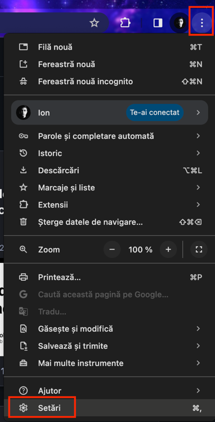
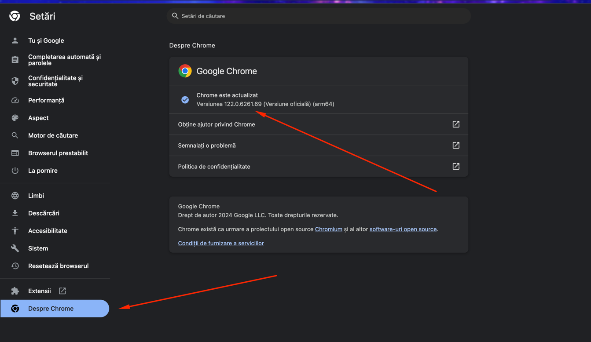
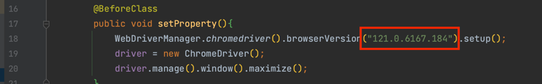

## TESTNG Testing Lesson

#### In this repository you have the code as a template
#### for testing the website : "https://demoqa.com/login"
#### You just clone this code in your machine using this command : ```git clone https://github.com/LunguIon/AlliedTestingDemo.git```
### Important Notes : 
#### 1. Set the browser version, In my case I use Chrome
####    Go to the browser settings and look for version : 

#### 2. Look for section about Chrome

#### 3. In the ```LoginTest.java``` line 18 change the version to the version of your browser



